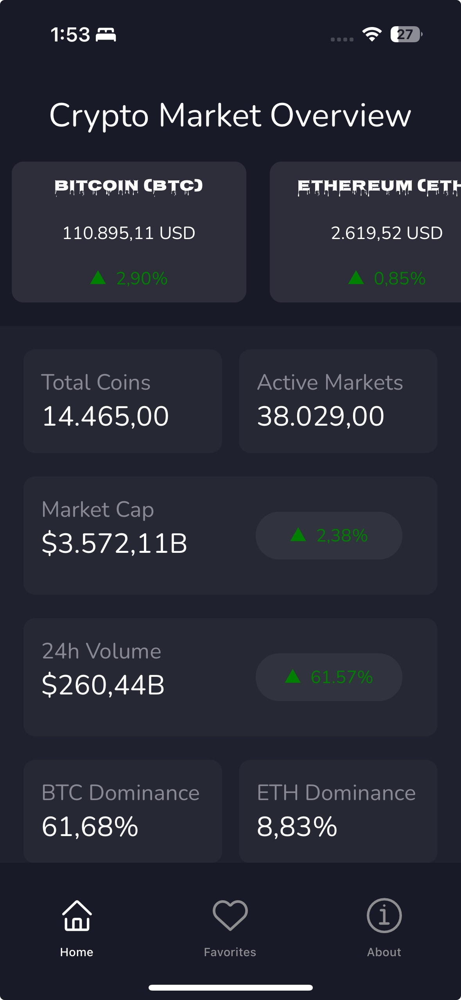
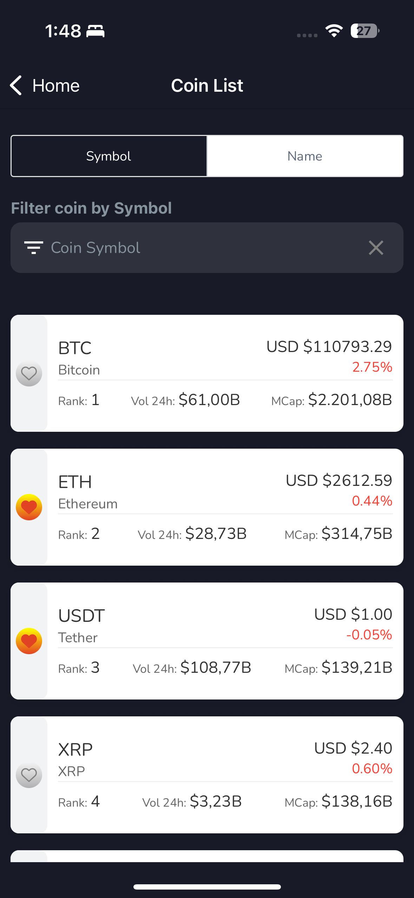
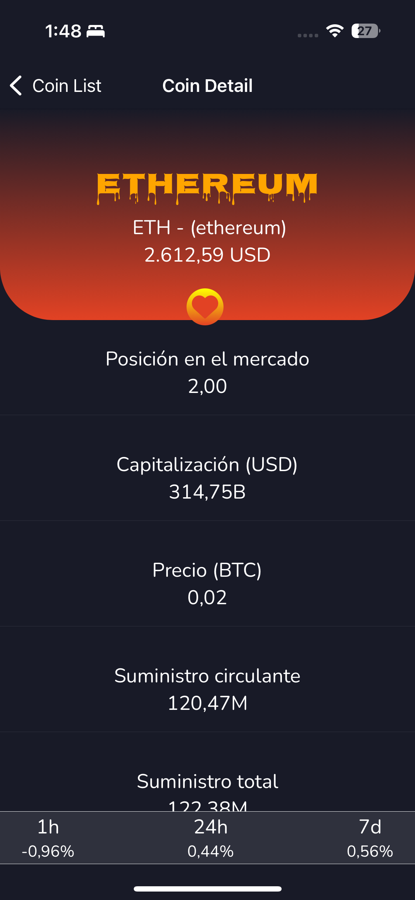
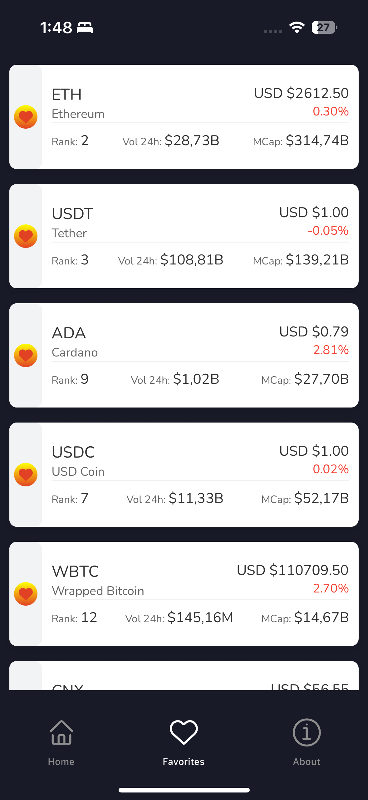
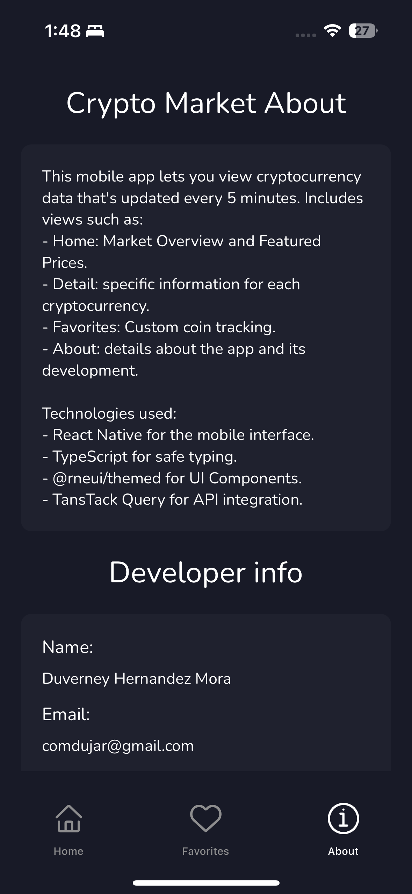

# Crypto Market

```

├── Home
|   └── Market
|       ├── Coin Detail
|       └── Search
├── Favorites
├── About
```

## Description

Crypto Market is a mobile application that allows users to track cryptocurrency prices, view detailed information about them, manage favorite coins, and stay up-to-date with the latest market values. The application features an intuitive interface, smooth navigation between screens, and is compatible with Android and iOS devices through Expo. Users can search for specific cryptocurrencies and add favorites for focused tracking.

## Installation

1. Ensure you have **Node.js v22.14.0** or higher installed.
2. Clone this repository to your local machine.
3. Install dependencies by running:
    ```bash
    npm install
    ```
4. Start the project with:
    ```bash
    npm start
    ```

## Running the Application

1. Install an Android or iOS emulator, or use a physical device with the **Expo Go** app installed.
2. Start your emulator or prepare your physical device.
3. If using an emulator:
    - Press **"a"** in the terminal to open the app in an Android emulator.
    - Press **"i"** in the terminal to open the app in an iOS emulator.
4. If using a physical device:
    - For **Android**: Open Expo Go, tap "Scan QR Code", and scan the QR code displayed in your terminal.
    - For **iOS**: Open the camera app and scan the QR code from your terminal, or open Expo Go and scan the code.

## Available Scripts

- `npm start`: Launches the development server.
- `npm run android`: Runs the app on an Android emulator or device.
- `npm run ios`: Runs the app on an iOS emulator or device.
- `npm run web`: Runs the app in a web browser.

## Features

- Real-time cryptocurrency market data
- Detailed coin information and price charts
- Latest cryptocurrency news
- Coin finder
- Favorite coins

## Screenshots

<div style="display: flex; flex-direction: row; gap: 16px; align-items: flex-start;">
    <div>
        
        <p align="center"><b>Home</b></p>
    </div>
    <div>
        
        <p align="center"><b>Market</b></p>
    </div>
    <div>
        
        <p align="center"><b>Coin Detail</b></p>
    </div>
    <div>
        
        <p align="center"><b>Favorites</b></p>
    </div>
    <div>
        
        <p align="center"><b>About</b></p>
    </div>
</div>


Below are some screenshots of the Crypto Market app. Each image is named according to its corresponding screen.

| Screen             | Screenshot                                               | Description                       |
|--------------------|----------------------------------------------------------|-----------------------------------|
| Home               |                 | Main dashboard with market data   |
| Market             |                | List of cryptocurrencies          |
| Coin Detail        |         | Detailed view of a selected coin  |
| Favorites          |         | User's favorite coins             |
| About              |                | App information and credits       |

## Contributing

Contributions are welcome! Please open an issue or submit a pull request for any improvements or bug fixes.

## License

This project is licensed under the MIT License.
